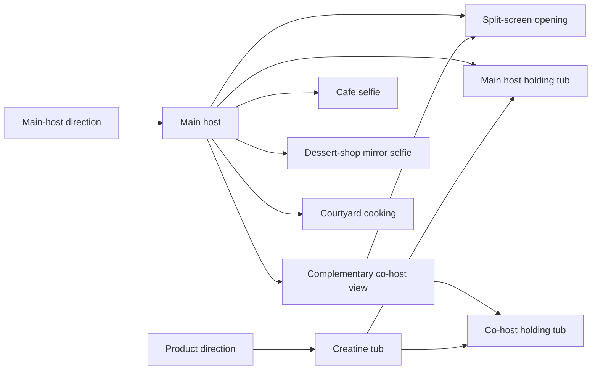

# Creatine podcast

[reference.svml](reference.svml) describes the complete image and video generation for a muscular,
beautiful host recommending creatine to a handsome, skinny co-host in glasses. The setting is outside
a Korean restaurant. [reference.svrun](reference.svrun) targets `final.video` without previous Results.

## The image relationships



All nine images are generated. The main host establishes identity and place. The co-host shows the
opposite side of that same conversation, with his own background details and mango bingsu. The two
holding views each use that host's own image plus the same generated tub. The three lifestyle views
branch directly from the main host. None depends on another lifestyle scene or a previous video tail.
The historical `*-hypihub` image files are not inputs to this entry.

The image prompts use the copied phone-image Kit. A product-only prompt directly describes the
creatine packaging. [reference.svs](reference.svs) owns this entry's appearance and video-Kit choices;
`recipes.svs` remains available to the independent variants.

## Performance and coverage

Two MiMo Voice Design requests establish recurring voices. Three Seedance Mini Takes carry the
Script: a five-second split opening, an eight-second product explanation, and a six-second handoff.
The opening uses its own small Text Template in `kits/split-opening.svs`, with dialogue bound from
Script. The other two use the podcast Kit. A silent listener still glances, adjusts posture and reacts.
The tub passes across a cut; the woman is empty-handed on the later return to her view.

One five-second silent B-roll request combines the three lifestyle pictures into a montage. The
second scene is strawberry bingsu, not a literal smoothie demonstration: the montage illustrates the
whole routine. It covers part of the incoming man's response, creating a J-cut and giving the final
cooking scene time to read. Its Recipe uses `once-start`: native-speed playback, truncation when the
Selection is shorter, and an end to coverage when the clip finishes. It does not freeze the last
frame or retime to fill the window. Inspect the newly aligned endpoint and adjust the Selection if
the actual montage needs more reading time. Exact word-to-scene reconstruction would use separate
media Items and adjoining Selections instead.

`shared-soundtrack.m4a` is the only supplied media asset on the final route. Images, voices and Takes
are generated; normalization, alignment, Caption and Film composition are explicit downstream work.

## Run and refine

```bash
hypit check reference.svrun
hypit measure reference.svml --segment opening-question --language en --pace fast --min 4 --max 15 --rounding ceil
hypit measure reference.svml --segment daily-creatine --language en --pace fast --min 4 --max 15 --rounding ceil
hypit measure reference.svml --segment arms-are-asking --language en --pace fast --min 4 --max 15 --rounding ceil
hypit plan reference.svrun --runtime ./hypit.runtime.json
```

The estimates are five, eight and six seconds. Inspect the selected Endpoints and pricing before
paid execution. With spending authorization, use `hypit build reference.svrun --runtime ./hypit.runtime.json --follow`.
Review the actual conversation, product continuity and B-roll handover; reuse produced media for
subsequent Caption or composition changes.

## Prompt provenance

The author's Studio export `studio-prompts-incremental-2026-08-29` contains the main-host prompt
used on August 28 at 09:27, the complementary co-host at 09:40, and the two-host product directions
with two references each. The earlier `studio-prompts-2026-08-28` export contains the creatine
product direction, split layout and cafe/dessert/cooking prompts from August 26–27. Those directions
were translated and adapted into the explicit graph here, preserving grape and mango bingsu in the
host views. The exported records include prompts, parameters and reference counts, but not a complete
mapping from each reference to its selected output; the graph also uses the author's explanation and
the actual project images. The voices are newly authored directions. This is a complete reproducible
request graph, not a claim that a fresh model run will reproduce the published pixels or voices.

`swap-host`, `swap-item` and `swap-app` remain separate variants.
